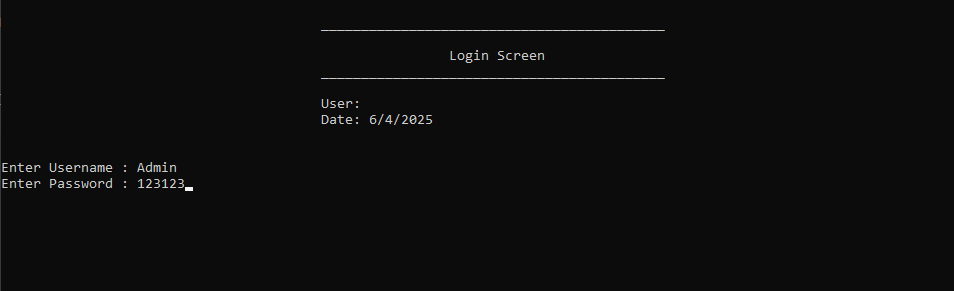
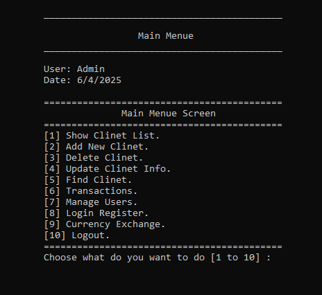
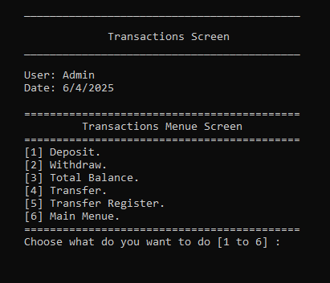
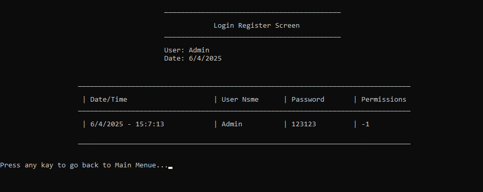
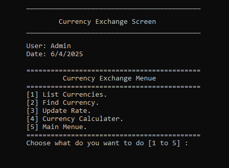

# Bank Management System (C++ / CLI / OOP)

A fully integrated banking management system built using Object-Oriented Programming (OOP) principles in C++. This project simulates a real-world banking system in a structured educational manner, reinforcing concepts such as inheritance, encapsulation, abstraction, polymorphism, and clean code organization into distinct layers.

## Project Idea

This system allows you to:

- Manage client data (Add, Edit, Delete, Search).
- Perform banking operations (Withdraw, Deposit, Transfer).
- Control user accounts and their permissions.
- Log login history (Login Logs).
- Log money transfers (Transfer Logs).
- Convert currencies.
- Interact via a clear and well-organized text-based user interface.

## Project Structure

```
BankSystem(oop)/
├── clsScreen.h                  ← Base screen class for all UI screens.
├── clsBankClient.h             ← Represents the bank client and related operations.
├── clsUser.h                   ← Represents system users and their permissions.
├── clsLoginScreen.h            ← Login interface.
├── clsMainScreen.h             ← Main menu interface.
├── clsCurrency.h               ← Class handling currency data and rates.
├── clsCurrencyCalculatorScreen.h ← Currency conversion interface.
├── clsTransferScreen.h         ← Transfer operation interface.
├── clsTransferHistory.h        ← Class to record transfer logs.
├── clsLoginHistory.h           ← Class to record login logs.
├── Global.h                    ← Shared global variables.
└── ...
```

## Features

- ✅ User Login System: Verifies username and password, logs each login attempt.
- ✅ User Permissions: Controls access levels (view, edit, delete, transfer, manage users).
- ✅ Client-to-Client Money Transfers: With each transaction logged in a dedicated transfer log.
- ✅ Text File Logging: Records operations in .txt log files.
- ✅ Currency Conversion Support: Converts between currencies using fixed exchange rates.
- ✅ Highly Organized Code: Layered architecture separating UI, logic, and data access.
- ✅ Safe Input Handling: Utilizes custom input validation utilities.

## Requirements

- C++ Compiler (e.g., GCC, MSVC).
- IDE like Visual Studio, Code::Blocks, or VS Code.

## How to Run

1. Ensure all .h and .cpp files (if any) are within the same project directory.
2. Open the project in your preferred development environment.
3. Run the main file containing the `main()` function.
4. Follow the instructions displayed in the text-based UI.

## Usage

- Login as a user → Access the main menu.
- Manage clients (add, delete, edit, search).
- Perform money transfers between clients.
- View transaction history.
- Log and review user login history.
- Use the currency converter for USD or any currency pair.

## Design

The system design is based on:

- **OOP Principles:** Including inheritance, encapsulation, and polymorphism.
- **Single Responsibility Principle:** Each class serves a single responsibility.
- **Layered Architecture:** UI layer separated from business logic and data handling.
- **Static Methods:** Used to perform operations related to classes without needing to instantiate objects.

## Data Security & Management

- **Caesar Cipher Encryption:** Ensures stored data is kept secure (used in user passwords, etc.).
- **Text File Data Storage:** Client and user data are stored in plain .txt files.
- **Activity Tracking:** Logs all login attempts and money transfer activities for auditing.

## Contributing

Have an idea to improve or extend the system? Here's how to contribute:

- Fork the repository.
- Implement your changes.
- Submit a Pull Request.
- Or, open an Issue to suggest a feature or report a bug.

## System Screenshots

- 🔐 Login Screen



- 📋 Main Menu



- 💸 Transfer Money Screen



- 📄 Login Logs



- 💱 Currency Conversion Calculator



## License

This is an open-source project for educational purposes. You are free to use, modify, and share it.
